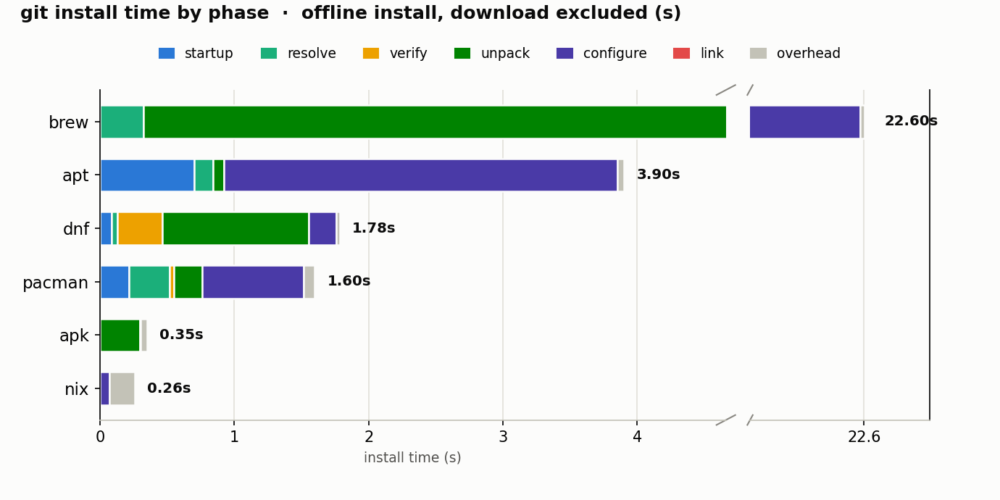

# linux-package-manager-bench

How long does it take to **install `git`** with each major Linux package manager —
and where does that time actually go? This benchmarks six managers (**apk, pacman,
dnf, apt, nix, brew**) in throwaway Docker containers.

To compare the **same unit of work**, each manager's **dependencies are pre-installed
during untimed setup**, so the timed phases handle only the **`git` package itself** (1
package) — not a different-sized dependency tree per manager. Each run splits into two
timed phases:

1. **Download** — fetch the `git` package into the local cache (its deps are already
   installed).
2. **Install (offline)** — the warm-cache container is frozen to an image, then `git` is
   installed in a fresh **`--network none`** container, repeated **N times** (default 5).
   Timing is measured *inside* the container (so docker-exec startup is excluded) and
   reported as the **median** with min–max. This isolates real install work from network
   speed and shows run-to-run variance.

Every line of both phases is timestamped with the elapsed time since the previous line,
so the install can be broken down step by step. Set `REPS=<n>` to change the repeat count.

> **agentos** appears in the results as a **hardcoded reference point** — it is *not* run by
> this Docker harness. Instead of a traditional package manager, agentOS loads a precomputed
> `.aospkg` into its VM; loading the `git` package takes **~0.017 ms** (median; min 0.013,
> max 0.020), with no download step. That number comes from the agentOS package-load
> benchmark, not from this repo:
> <https://github.com/rivet-dev/agentos/blob/f66918af5708776823b57fafc6b8d0e318e08764/crates/native-sidecar/tests/projection_bench.rs#L606>

## Latest results

Auto-generated by `synthesize.js` on the last run — the chart and matrix below, and the
**host hardware** they came from, are rewritten between the markers on every run.

<!-- RESULTS:START -->


### Host

- **CPU:** 12th Gen Intel(R) Core(TM) i7-12700KF (20 logical cores)
- **Memory:** 67.2 GB   **Arch:** x64   **Kernel:** 6.1.0-41-amd64
- **OS:** Debian GNU/Linux 12 (bookworm)   **Docker:** 28.3.1
- **Disk (/):** /dev/nvme0n1p2 ext4  937G  261G
- **Generated:** 7/6/2026, 3:51:01 AM PDT

### Phase correlation matrix

_`install MEDIAN` is the median of 30 offline runs (`install min–max` shown); sub-phases are a heuristic bucketing of log lines (see README). `download*` is a single, network-dependent sample._

| phase (s) | agentos | apk | pacman | dnf | apt | nix | brew |
|---|---:|---:|---:|---:|---:|---:|---:|
| **download\*** | 0.00 | 0.63 | 1.02 | 1.89 | 1.06 | 6.83 | 3.02 |
| install: startup | 0.00 | 0.00 | 0.05 | 0.02 | 0.00 | 0.00 | 0.00 |
| install: resolve | 0.00 | 0.00 | 0.10 | 0.04 | 0.09 | 0.00 | 0.00 |
| install: verify | 0.00 | 0.00 | 0.02 | 0.23 | 0.00 | 0.00 | 0.00 |
| install: unpack | 0.00 | 0.00 | 0.00 | 0.02 | 0.05 | 0.00 | 0.00 |
| install: configure | 0.00 | 0.00 | 0.06 | 0.00 | 0.26 | 0.00 | 1.09 |
| install: link | 0.00 | 0.00 | 0.00 | 0.00 | 0.00 | 0.00 | 0.00 |
| install: unknown | 0.00 | 0.04 | 0.03 | 0.03 | 0.09 | 0.00 | 0.40 |
| **install MEDIAN** | 0.00 | 0.25 | 0.48 | 0.27 | 0.87 | 0.59 | 2.11 |
| install min–max | 0.00–0.00 | 0.23–0.28 | 0.43–0.53 | 0.25–0.38 | 0.85–0.92 | 0.29–0.60 | 2.07–2.14 |
| git version | wasm | 2.54.0 | 2.55.0 | 2.55.0 | 2.39.5 | 2.54.0 | 2.51.2 |
| deps ~ | 1 | 1 | 1 | 1 | 1 | 84 | 1 |
| download size | — | — | 7.11 MiB | 5 MiB | 7264 kB | 127.7 MiB | — |

_Each manager installs only the `git` package with deps pre-installed, so `deps ~` = 1 (nix shows its store closure and is not counted). The `install: *` split is from a single (last) rep, not the median. **nix** caveat: its install is a profile symlink flip — unpack happens during the download phase (store realization), so its install time is **not** comparable to the others' unpack._

### Top install sub-steps (by measured delta)

- **agentos** (agentos VM (V8/wasm)): 
- **apk** (alpine:latest): `0.037s Executing busybox-1.37.0-r31.trigger` · `0.003s OK: 20.4 MiB in 28 packages` · `0.000s (1/1) Installing git (2.54.0-r0)`
- **pacman** (archlinux:latest): `0.097s Optional dependencies for git` · `0.059s :: Running post-transaction hooks...` · `0.033s (2/3) Reloading system manager configuration..`
- **dnf** (fedora:latest): `0.235s [1/4] Verify package files              100% |` · `0.041s [2/4] Prepare transaction               100% |` · `0.030s [4/4] Removing git-core-0:2.55.0-1.fc44 100% |`
- **apt** (debian:12-slim): `0.197s Setting up git (1:2.39.5-0+deb12u3) ...` · `0.090s Building dependency tree...` · `0.085s Suggested packages:`
- **nix** (nixos/nix): `0.001s warning: you don't have Internet access; disab` · `0.000s warning: 'install' is a deprecated alias for '`
- **brew** (homebrew/brew): `1.088s ==> Caveats` · `0.400s ==> Fetching git` · `0.000s ==> Fetching downloads for: git`
<!-- RESULTS:END -->

## Run it

```bash
node run.js                          # all managers (fast -> slow), then synthesize + chart
node run.js apk pacman               # just a subset
node synthesize.js && python3 chart.py   # re-render tables + chart from existing logs
```

**Prerequisites:** Docker (daemon running) and Node.js 18+ for the benchmark; Python 3 +
matplotlib (`pip install -r requirements.txt`) for the chart. The `ts` timestamper is a
tiny bundled script (`lib/ts.js`) — no `moreutils` needed.

Output lands in `results/` (git-ignored): per-manager `*-download.log`, `*-install.log`,
`*.json`, `results/RESULTS.md`, and `results/data.json`. The committed **`chart.png`**
(embedded above) is regenerated on every run.

## How it works (three stages)

- **`run.js`** (stage 1) — for each manager, calls `benches/<mgr>.sh`, which uses the
  shared harness `benches/_lib.sh` to: start a container, do untimed **setup** (pull repo
  metadata and **pre-install git's dependencies**, so only git itself is left to install),
  time the **download** of the git package, then `docker commit` the warm-cache
  container to an image and run the **offline install** `REPS` times, each in a fresh
  `--network none` container. Timing is host wall-clock minus a measured `docker exec`
  baseline; every line is piped through `lib/ts.js`; a failed install (or missing
  `git --version`) fails the manager loudly. Writes the median + min–max to `<mgr>.json`.
- **`synthesize.js`** (stage 2) — parses the ts-stamped logs with regex, classifies each
  install line into a canonical phase, and emits the **phase × manager matrix**,
  `results/RESULTS.md`, and `results/data.json`.
- **`chart.py`** (stage 3) — renders `results/data.json` into the **stacked-bar
  `chart.png`** with matplotlib (broken x-axis so one slow manager can't crush the rest).

## Reading the matrix

Rows are phases (seconds), columns are managers. `install MEDIAN` (median of N runs, with
`install min–max`) is ground truth; `download*` is a single network-dependent sample. The
`install: *` sub-rows (and the chart's colored segments) bucket each timestamped install
line into canonical phases:

| bucket | what lands here |
|---|---|
| `startup` | package-manager start, reading state/db |
| `resolve` | dependency resolution, transaction prepare/check, conflict/key checks |
| `verify` | package integrity / signature / GPG verification |
| `unpack` | unpacking / pouring / extracting / installing file payloads |
| `configure` | scriptlets, triggers, post-install hooks, sysusers, cert stores |
| `link` | symlinks, ldconfig, profile generation |
| `unknown` | lines that matched no rule (visible, never silently folded into another phase) |
| `overhead` | install wall-time not attributed to any log line (time before first / after last line) |

These sub-buckets are a **heuristic** classification of human-readable log lines and vary
with tool versions — treat them as directional. `ts` charges each line's delta to the line
that *ends* the interval, so a step's cost can land on the following line (often an
unmatched one → `unknown`); and the split comes from a single (last) rep, not the median
run. The `install MEDIAN` / min–max totals are the exact, repeated measurement.

The **`verify` row is not cross-comparable**: managers verify at *different phases* (apt
verifies during download, so its install `verify` = 0 despite real work earlier), and some
skip signature checks at install — **apk** (`--allow-untrusted`) skips all verification, and
**dnf** installs a local `@commandline` rpm so it **skips the OpenPGP signature check** (it
still checksums the payload). A 0 or a large `verify` cell means different things per manager.

## Caveats

- **Same unit of work — the git package only.** Every manager's dependencies are
  pre-installed in untimed setup, so the timed install handles exactly **1 package (git)**,
  not a different-sized dependency tree. What still differs is git itself: version
  (2.39–2.55) and packaging — on Fedora `git` is a thin metapackage, so we install/measure
  **`git-core`** (the real binary payload); other distros ship git's binary in the `git`
  package directly.
- **nix's install is not comparable to the others'.** For apt/dnf/pacman/apk/brew the git
  unpack happens during the timed install; for nix it happens during *download* (store
  realization), so nix's install is just a profile **symlink flip**. Its low install
  number reflects a different operation, not a faster one — the chart hatches it.
- **Install mechanics still differ slightly.** apt/pacman/apk install git fresh (unpack +
  configure), dnf **reinstalls** `git-core` (which also *removes* the old copy — a step the
  fresh installs don't do, working slightly against dnf), and brew pours git's bottle and
  then re-verifies its SHA + runs `brew cleanup` + prints caveats (bookkeeping the others
  skip). On verification: **apk** (`--allow-untrusted`) skips all checks and **dnf** (local
  `@commandline` rpm) skips the OpenPGP signature check — so their low `verify` is partly a
  skipped step, not speed.
- **Reproducibility.** Install is the median of N runs (min–max shown) measured in-container
  and run under `--network none`, but it is still CPU/IO-sensitive: on a contended host the
  numbers inflate. Run on an otherwise-idle machine; treat sub-second gaps between the
  middle managers as within noise. `download*` is a single sample and mixes in mirror
  speed — not a manager comparison.
- **Warm page cache.** Install reads come from RAM (files written seconds earlier), so
  they reflect warm reads, not a cold first-install; this discounts I/O-heavy managers
  (brew, apt) more than nix. The recorded `image_digest` per manager pins provenance, but
  base images are `:latest` and drift over time.
- **brew** setup clones the full `homebrew-core` tap (slow — minutes); untimed, and pins
  installs to the local tap for determinism.
- Re-running is destructive to same-named containers (`<mgr>-bench`, `<mgr>-rep*`), which
  are force-removed at start and teardown.

## License

MIT — see [LICENSE](LICENSE).
